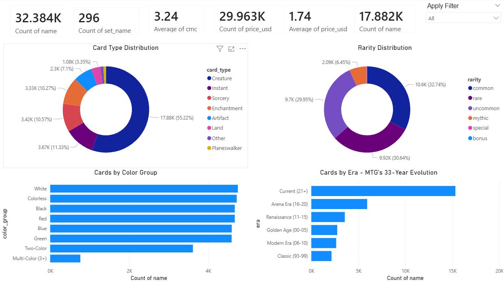
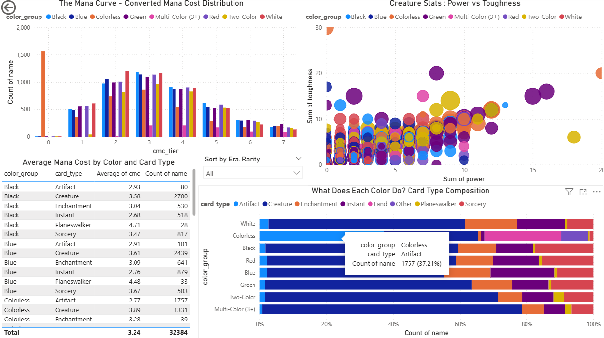
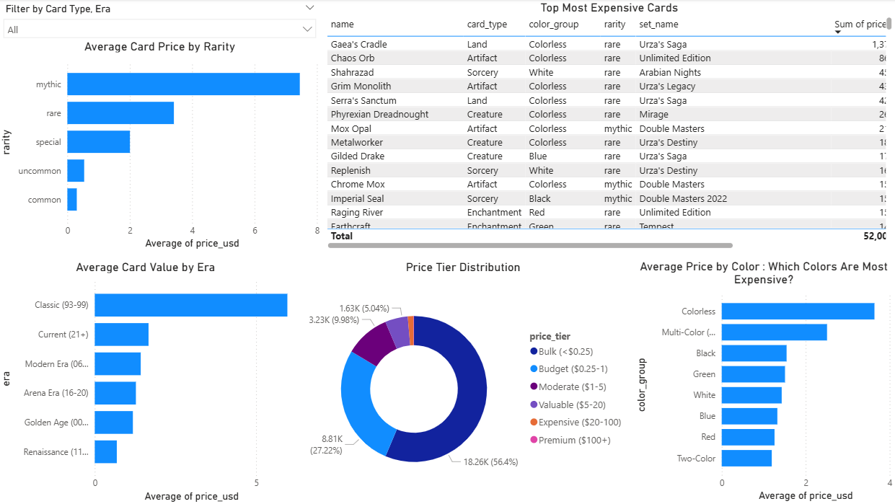
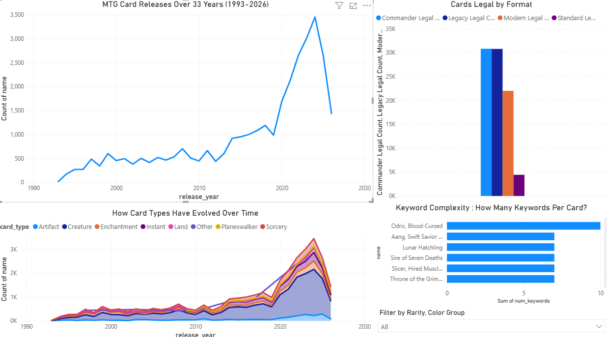

# MAGIC: THE GATHERING META ANALYSIS DASHBOARD

An interactive Power BI dashboard analyzing **32,384 Magic: The Gathering cards** across 296 sets and 33 years of game history featuring mana curve analysis, color composition, market valuations, set evolution and format legality insights. This is powered by live data from the Scryfall API.



## PROJECT OVERVIEW

Magic: The Gathering is the world's most complex trading card game, with over 30,000 unique cards spanning three decades. This dashboard transforms Scryfall's comprehensive card database into interactive visualizations that answer the questions players, collectors and game designers care about:

- How has the card pool evolved over 33 years?
- What does the ideal mana curve look like, and does it differ by color?
- Which cards command the highest market prices, and why?
- How do the five colors differ in their design philosophy?
- What percentage of all cards are legal in each competitive format?

## KEY FINDINGS

### The Card Pool at a Glance
- **32,384 unique cards** across **296 sets** with an average converted mana cost of **3.24**
- **Creatures dominate** at 55.2% of all cards (17,882), followed by Instants (11.3%), Sorceries (10.6%), and Enchantments (10.3%)
- Rarity is surprisingly balanced: **Common (32.7%)**, **Rare (30.6%)**, and **Uncommon (30.0%)** are nearly equal, with **Mythic Rares at just 6.5%** maintaining their prestige
- The five mono-colors are remarkably balanced (4,593–4,751 cards each), reflecting Wizards of the Coast's commitment to color parity

### MTG's Explosive Growth
- Card output has **skyrocketed since 2020**, with the current era (2021+) containing **15,331 cards** which is nearly half the entire card pool, more than the first 22 years combined
- The release chart shows a dramatic inflection point around 2019-2020, coinciding with MTG Arena's launch and Wizards' aggressive supplemental product strategy
- The card type evolution shows **Creatures have grown disproportionately** in recent years, while Instants and Sorceries have maintained steadier output reflecting a design shift toward board centric gameplay

### Mana Curve Insights
- The mana curve peaks at **CMC 2-3** across all colors, confirming the game's fundamental design around early-game efficiency
- **Red** has the most aggressive mana curve, with its highest concentration at CMC 1 matching its identity as the fast, aggressive color
- **Colorless cards** skew toward CMC 0 (mana rocks, artifacts) and high CMC (Eldrazi), creating a bimodal distribution unique among color groups
- The creature Power vs Toughness scatter reveals a strong correlation with most creatures clustering along the diagonal, but notable outliers exist with high toughness/low power defenders and glass-cannon attackers

### Color Design Philosophy (Confirmed by Data)
- **White**: most balanced type composition - roughly equal creatures, enchantments, instants and sorceries. The "fair" color
- **Blue**: highest proportion of Instants among all colors - reflecting its reactive, counter-spell identity
- **Black**: heavy creature and sorcery focus - aligning with its themes of reanimation and targeted removal
- **Red**: similar to Black but with more Instants (burn spells) - aggressive and reactive
- **Green**: most creature-heavy of all colors - the "biggest creatures" color confirmed by data
- **Colorless**: dominated by Artifacts (37.2%), as expected - these are the tools available to all colors

### Market Value Analysis
- **56.4% of cards are bulk** (under $0.25), while only **33 cards achieve Premium status** ($100+) - extreme value concentration
- **Mythic Rares average ~$5.50** while Commons average under $0.25 - a **22x price multiplier** for rarity alone
- **Classic era cards (1993-99) are by far the most valuable** at ~$7 average - scarcity and nostalgia drive prices on the Reserved List
- **Colorless cards have the highest average price** - driven by powerful artifacts and lands like Gaea's Cradle ($1,300+), Chaos Orb and the Mox cycle
- The Top 25 most expensive cards are dominated by **Urza's Saga**, **Unlimited Edition** and **Arabian Nights** which are the earliest and rarest sets

### Format Legality
- **Commander and Legacy** have the largest legal card pools (~31,000 each), explaining Commander's popularity as the format with the most deckbuilding variety
- **Modern** allows ~24,000 cards which is roughly 75% of all cards
- **Standard** is the most restrictive at ~3,000 cards, creating its fast-rotating, accessible metagame
- The massive gap between Commander/Legacy and Standard legal pools visually demonstrates why eternal formats feel so different from rotating ones



## DASHBOARD PAGES

### Page 1: Overview
KPI cards (total cards, sets, avg CMC, creatures, priced cards, avg price), card type and rarity donuts, color distribution, era timeline, interactive slicers

### Page 2: Mana & Color Analysis
Mana curve by color group, creature power vs toughness scatter, card type composition by color (100% stacked), average CMC matrix by color and type

### Page 3: Market Value
Average price by rarity, Top 25 most expensive cards table, average value by era, price tier distribution, average price by color

### Page 4: Set Evolution
33-year release timeline, card type evolution stacked area, format legality comparison, keyword complexity ranking




## TOOLS AND TECHNOLOGIES

- **Power BI Desktop** - an interactive dashboard development
- **DAX** - format legality measures, calculated aggregations
- **Power Query** - data loading and type configuration
- **Python** - data fetching and transformation
- **Scryfall API** - live MTG card database (updated daily)

### Power BI Skills Demonstrated
- Multi-page interactive dashboards with cross-filtering
- DAX measures with CALCULATE and COUNTROWS
- Scatter plots with multi-dimensional encoding
- 100% stacked bars for composition analysis
- Top N visual-level filtering
- Donut charts, line charts, matrix tables
- Interactive dropdown slicers

## PROJECT STRUCTURE

```
mtg-meta-analysis-dashboard/
├── data/
│   ├── scryfall_oracle_cards.json     # Raw Scryfall API data
│   └── mtg_powerbi_ready.csv          # Processed dataset (32K cards)
├── powerbi/
│   └── MTG_Meta_Dashboard.pbix        # Power BI dashboard
├── scripts/
│   └── fetch_mtg_data.py              # Scryfall API fetcher + transformer
├── images/                            # Dashboard screenshots
└── README.md
```

## GETTING STARTED

### Prerequisites
- Power BI Desktop
- Python 3.10+

### Setup
```bash
git clone https://github.com/rush2pranav/mtg-meta-analysis-dashboard.git
cd mtg-meta-analysis-dashboard

pip install pandas requests
python scripts/fetch_mtg_data.py

# Open powerbi/MTG_Meta_Dashboard.pbix in Power BI Desktop
```

### Refreshing Data
The Scryfall API updates daily. Re-run `fetch_mtg_data.py` after new set releases to get the latest cards and prices, then refresh the Power BI data source.

## WHAT I LEARNED

- **Live API data beats static datasets** Pulling from Scryfall's bulk data API means this dashboard can be refreshed after every new set release, it's a living analysis, not a snapshot. This is how production analytics tools work.
- **Card game data is deceptively complex** Handling dual-faced cards, split cards, variable power/toughness (X and *) and multi-color identity required careful transformation logic. Clean data modeling is half the battle.
- **Price distributions follow a power law** The extreme concentration of value (56% bulk, 0.1% premium) is a textbook example of a long-tail distribution, common in collectible markets. Visualizing this with price tiers makes the pattern immediately clear.
- **Era-based analysis tells the product strategy story** The explosion of cards post-2020 isn't just a data point, it reflects Wizards' shift to multiple premium products per year, Secret Lairs and digital-first design with Arena. Data captures business strategy.

## POTENTIAL EXTENSIONS

- Add a Deck Builder page analyzing mana curves for user-selected cards
- Integrate EDHREC popularity data for Commander format meta analysis
- Add price trend tracking by fetching weekly snapshots over time
- Build a "Set Value" calculator totaling expected value of booster boxes
- Add creature subtype analysis (how many Elves vs Goblins vs Dragons?)
- Create a "Color Pair Synergy" page analyzing two-color card design patterns